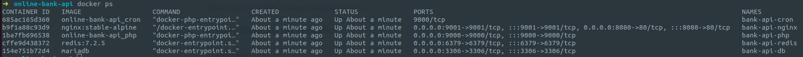
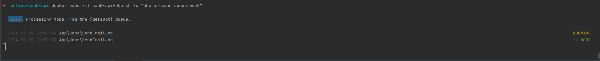
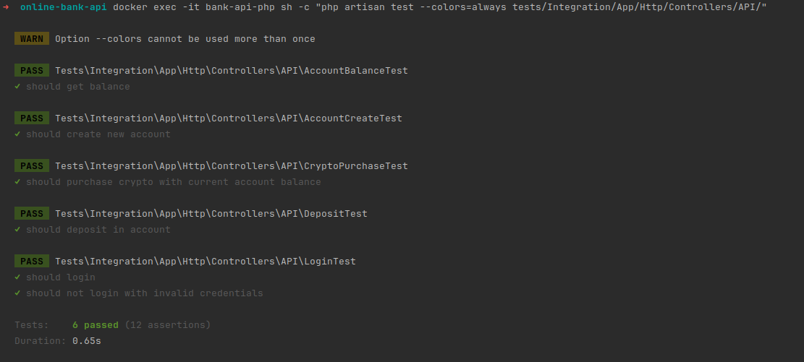
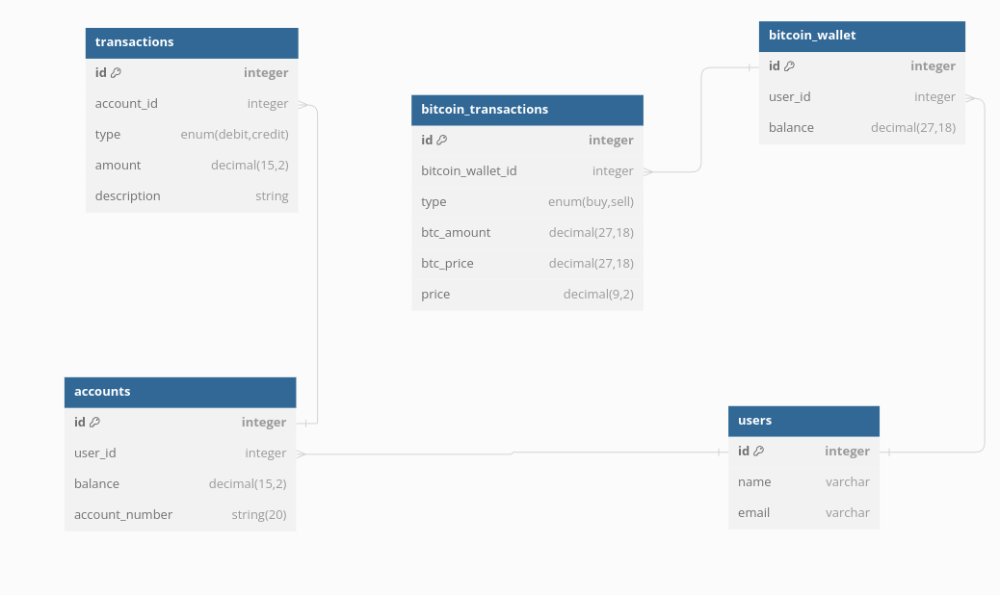
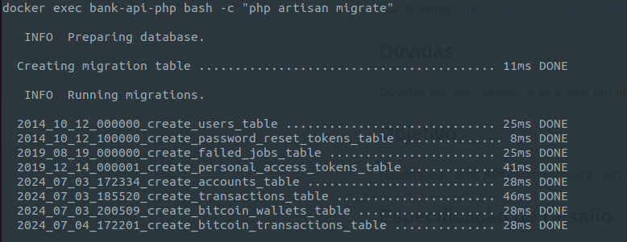

## Online Banking API 

#### Rodar para configurar setup (containers docker, composer e banco de dados)
```
make setup
```


#### Processar filas (Emails são enfileirados para não causar gargalos e em caso de falhas podem até ser reprocessados)
```
docker exec -it bank-api-php sh -c "php artisan queue:work"
```


#### Rodar switch de tests:
```
docker exec -it bank-api-php sh -c "php artisan test --colors=always tests/Integration/App/Http/Controllers/API/"
```


##### Modelo do banco de dados:


##### Migrations:

